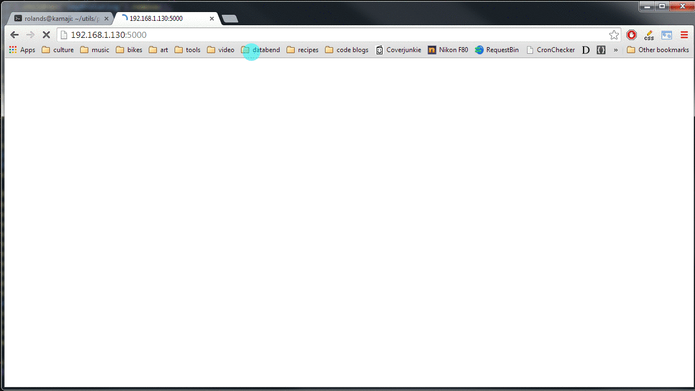

pip-check
=========

web app to manage pip updates more easilyerly ^_^

Usage
-----

    $ python pip-check.py -h
	usage: pip-check.py [-h] [-H HOST] [-P PORT] [-L] [--log LOG] [--pip3]

	Web App to display updates for installed pip packages on your system.

	optional arguments:
	  -h, --help            show this help message and exit
	  -H HOST, --host HOST  Specify host to serve on (be careful, this can expose
	                        pip to the network), defaults to 127.0.0.1.
	  -P PORT, --port PORT  Specify port to server on, defaults to 5000.
	  -L, --local           Hide global packages if inside a virtualenv.
	  --log LOG             Log to specified file.
	  --pip3                Use pip3, default is pip.

Screenshots
-----------

